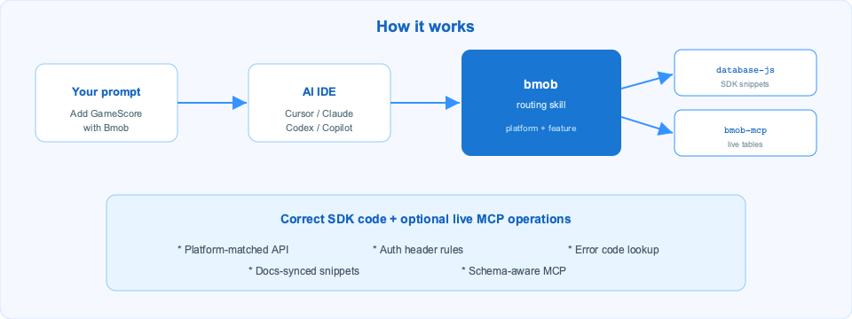
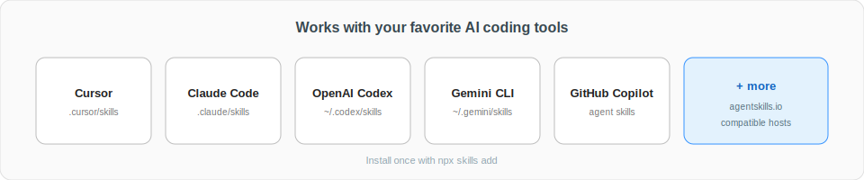
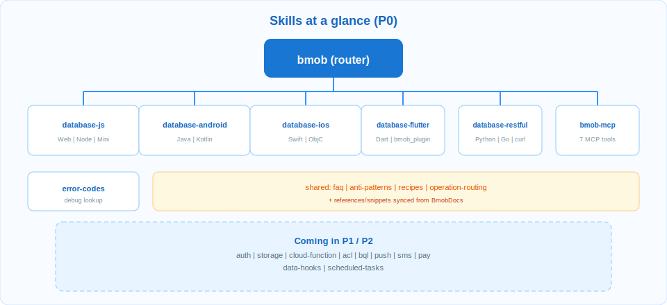

# Bmob Agent Skills

**English** | [简体中文](./README.zh-CN.md)

<p align="center">
  
</p>

> Production-oriented Agent Skills for [Bmob backend cloud](https://www.bmobapp.com/), designed for Cursor, Claude Code, OpenAI Codex, Gemini CLI, GitHub Copilot, and other [agentskills.io](https://agentskills.io/)-compatible AI tools.

`@bmob/agent-skills` helps AI agents generate platform-correct Bmob code and perform schema-aware operations through MCP. It reduces cross-platform API confusion, avoids unsafe key usage, and improves troubleshooting quality with deterministic routing.

<p align="center">
  
</p>

## Why this project

- **Correctness first**: route prompts to the right platform skill (JavaScript, Android, iOS, REST) before code generation.
- **Operational capability**: integrate the hosted Bmob MCP server for live table introspection and data operations.
- **Security guardrails**: embed explicit “NOT for” constraints and key-usage boundaries inside skills.
- **Maintainability**: references are synced from BmobDocs and validated in CI.
- **Portability**: works across mainstream AI coding hosts with the same skill package.

## What you get

<p align="center">
  
</p>

- Router skill: `bmob` (entrypoint for all Bmob-related prompts)
- MCP operations: `bmob-mcp` (7 live tools)
- SDK/REST implementation skills:
  - `bmob-database-javascript`
  - `bmob-database-android`
  - `bmob-database-ios`
  - `bmob-database-restful`
- Troubleshooting skill: `bmob-error-codes`

## Quick start

### 1) Install all skills (recommended)

```bash
npx skills add bmob/agent-skills -y -g
```

This copies all `skills/*` into your AI tool’s skills directory (for example: `.cursor/skills/`, `.claude/skills/`, `~/.codex/skills/`, `~/.gemini/skills/`).

### 2) Install specific skills

```bash
npx skills add bmob/agent-skills --skill bmob
npx skills add bmob/agent-skills --skill bmob-database-javascript
npx skills add bmob/agent-skills --skill bmob-mcp
```

### 3) Manual install

```bash
git clone https://github.com/bmob/agent-skills.git
# Cursor (project scope)
cp -r agent-skills/skills/bmob-database-javascript .cursor/skills/
# Claude Code (user scope)
cp -r agent-skills/skills/bmob ~/.claude/skills/
# OpenAI Codex
cp -r agent-skills/skills/bmob-mcp ~/.codex/skills/
```

## Configure Bmob MCP (optional, recommended)

Use snippets from [`shared/mcp-install-snippets.md`](shared/mcp-install-snippets.md):

- Cursor: `.cursor/mcp.json` or `~/.cursor/mcp.json`
- Claude Code: `.mcp.json` or `~/.claude.json`
- OpenAI Codex CLI: `~/.codex/config.toml`
- VS Code / GitHub Copilot: `.vscode/mcp.json`

Then ask:

```text
List all tables in my Bmob project
```

The agent should call `get_project_tables` and return live schema.

> Security note: current MCP endpoint is `http://mcp.bmobapp.com/mcp` (HTTP). Use in local development only, and never commit real keys.

## Available skills

<p align="center">
  
</p>

| Skill | Purpose |
|---|---|
| [`bmob`](skills/bmob/SKILL.md) | Routing entrypoint for all Bmob prompts |
| [`bmob-mcp`](skills/bmob-mcp/SKILL.md) | Live MCP operations: `get_project_tables`, `create_table`, `add_single_data`, `update_single_data`, `delete_single_data`, `generate_code`, `mcp_endpoint_mcp_post` |
| [`bmob-database-javascript`](skills/bmob-database-javascript/SKILL.md) | Cross-platform `hydrogen-js-sdk` for Web, Node.js, mini programs, Cocos Creator JS, Electron, Tauri, hybrid apps |
| [`bmob-database-android`](skills/bmob-database-android/SKILL.md) | Android native SDK (Java / Kotlin) |
| [`bmob-database-ios`](skills/bmob-database-ios/SKILL.md) | iOS native SDK (Objective-C / Swift) |
| [`bmob-database-restful`](skills/bmob-database-restful/SKILL.md) | REST API integration for backend languages and scripts |
| [`bmob-error-codes`](skills/bmob-error-codes/SKILL.md) | Error-code lookup and diagnostics guidance |

## Usage examples

| Prompt | Expected routing |
|---|---|
| “Add a GameScore row in Next.js with Bmob” | `bmob` + `bmob-database-javascript` |
| “How to query Bmob in Android Kotlin?” | `bmob` + `bmob-database-android` |
| “Swift login with Bmob” | `bmob` + `bmob-database-ios` |
| “Give me curl for Bmob CRUD” | `bmob` + `bmob-database-restful` |
| “Create a Player table for me” | `bmob` + `bmob-mcp` |
| “What does error 9015 mean?” | `bmob` + `bmob-error-codes` |

## Project architecture

- **Skill users**: install and use skills directly in AI tools
- **Maintainers**: update skill logic and extract snippets from BmobDocs
- **CI**: validates frontmatter and links, and runs MCP smoke checks when secrets are configured

See [CONTRIBUTING.md](CONTRIBUTING.md) for development workflow.

## Local development (for maintainers)

Requirements: Node.js `>=18`, `pnpm`.

```bash
git clone --recurse-submodules https://github.com/bmob/agent-skills.git
cd agent-skills
pnpm install
pnpm run validate
```

Useful scripts:

- `pnpm run validate` — frontmatter + relative link checks
- `pnpm run extract:local` — extract snippets from local `vendor/BmobDocs`
- `pnpm run extract:remote` — extract snippets from remote raw docs
- `pnpm run new:skill` — scaffold a new skill

## Roadmap

- **P0 (current)**: bmob, bmob-mcp, database x 4 platforms, error-codes
- **P1**: auth x 4, storage x 4, cloud-function x 5, acl-and-roles, bql
- **P2**: push x 4, sms x 2, pay-restful, data-hooks, scheduled-tasks, best-practices

## FAQ

### Do I need to manually enable a skill?

No. Skills are loaded on-demand by your AI host based on prompt content.

### Can I use only one skill instead of all?

Yes. Install only what you need with `--skill`.

### Is MCP required?

No. SDK/REST skills work without MCP. MCP is recommended when you need live schema/data operations inside the IDE.

## Contributing

See [CONTRIBUTING.md](CONTRIBUTING.md).

## License

MIT — see [LICENSE](LICENSE).
