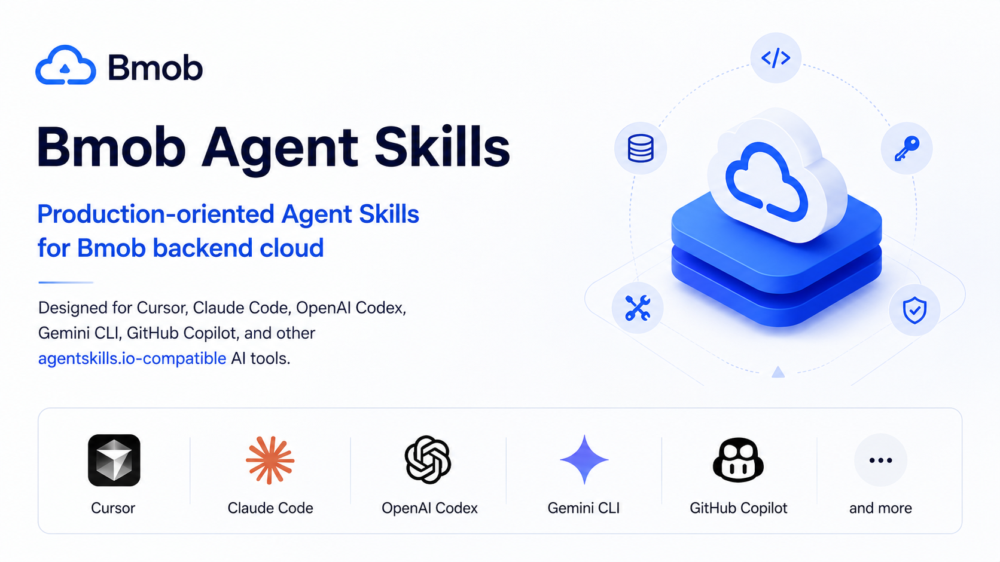
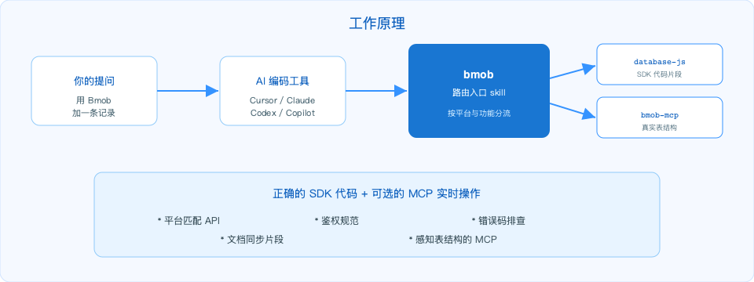
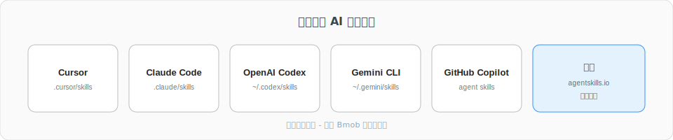

# Bmob Agent Skills

[English](./README.md) | **简体中文**

<p align="center">
  
</p>

> 让 Cursor、Claude Code、OpenAI Codex、Gemini CLI、GitHub Copilot 等主流 AI 编码工具能正确使用 [Bmob 后端云](https://www.bmobapp.com/) 的各项能力。

本仓库提供一组遵循 [agentskills.io 开源标准](https://agentskills.io/) 的 Agent Skills，覆盖 Bmob 的数据服务、用户认证、文件存储、云函数、推送、短信、支付、ACL/角色、错误码等模块，并把 [Bmob MCP Server](http://mcp.bmobapp.com/mcp) 的 7 个真实工具集成进来，让 AI agent 既能「读会写 SDK 代码」，也能「在 IDE 里直接对你的数据表做实操」。

<p align="center">
  
</p>

## 安装

<p align="center">
  
</p>

### 1. 一键安装全部 skill（推荐）

```bash
npx skills add bmob/agent-skills -y -g
```

这会把所有 `skills/*` 自动复制到你当前 AI 工具的 skills 目录（Cursor 是 `.cursor/skills/`、Claude Code 是 `.claude/skills/`、Codex 是 `~/.codex/skills/`、Gemini CLI 是 `~/.gemini/skills/` 等）。

### 2. 仅安装指定 skill

```bash
npx skills add bmob/agent-skills --skill bmob
npx skills add bmob/agent-skills --skill bmob-database-javascript
npx skills add bmob/agent-skills --skill bmob-mcp
```

### 3. 手动安装

任意主流 agent skill 都接受复制目录的方式：

```bash
git clone https://github.com/bmob/agent-skills.git
# Cursor 项目级
cp -r agent-skills/skills/bmob-database-javascript .cursor/skills/
# Claude Code 用户级
cp -r agent-skills/skills/bmob ~/.claude/skills/
# OpenAI Codex
cp -r agent-skills/skills/bmob-mcp ~/.codex/skills/
```

### 4. 配置 Bmob MCP Server（可选但强推荐）

复制 [`shared/mcp-install-snippets.md`](shared/mcp-install-snippets.md) 中对应你工具的片段到 mcp 配置文件里。配置后，向 agent 说「列出我 bmob 项目里的所有数据表」应当返回真实表结构。

## 现有 Skills

<p align="center">
  
</p>

| Skill | 作用 |
|---|---|
| [`bmob`](skills/bmob/SKILL.md) | 总入口 / 路由 skill，凡是用户提到 Bmob 都先命中这里，再分流到具体 sub-skill |
| [`bmob-mcp`](skills/bmob-mcp/SKILL.md) | Bmob MCP Server 的 7 个真实工具用法（`get_project_tables` / `create_table` / `add_single_data` / `update_single_data` / `delete_single_data` / `generate_code` / `mcp_endpoint_mcp_post`） |
| [`bmob-database-javascript`](skills/bmob-database-javascript/SKILL.md) | 跨端 [hydrogen-js-sdk](https://github.com/bmob/hydrogen-js-sdk) — 浏览器 / Node.js / 微信小程序 / 支付宝/字节/QQ/百度小程序 / 快应用 / Cocos Creator JS / Electron / Tauri / 混合 App |
| [`bmob-database-android`](skills/bmob-database-android/SKILL.md) | Android 原生 SDK（Java / Kotlin） |
| [`bmob-database-ios`](skills/bmob-database-ios/SKILL.md) | iOS 原生 SDK（Objective-C 与 Swift） |
| [`bmob-database-restful`](skills/bmob-database-restful/SKILL.md) | REST API — 任意没 SDK 的语言（Python / Go / PHP / C# / Rust / Ruby / Java 后端） |
| [`bmob-error-codes`](skills/bmob-error-codes/SKILL.md) | 错误码字典 + 排查指引 |

更多 skill（认证 / 存储 / 云函数 / 推送 / 短信 / 支付 / ACL / BQL）正在 P1、P2 波次中陆续到来——见 [路线图](#路线图)。

## 怎么用

skill 由你的 AI 工具按需自动加载——你不需要手动「启用」任何东西。只要在 prompt 里提到 Bmob，agent 会自动激活总入口 [`bmob`](skills/bmob/SKILL.md) 并路由到具体 sub-skill。例如：

| 你说 | 自动激活 |
|---|---|
| 「用 bmob 在 Next.js 里加一条 GameScore 记录」 | `bmob` + `bmob-database-javascript` |
| 「Android Kotlin 怎么用 bmob 查询」 | `bmob` + `bmob-database-android` |
| 「Swift 端连 bmob 怎么登录」 | `bmob` + `bmob-database-ios`（+ 将来 `bmob-auth-ios`） |
| 「curl 怎么操作 bmob」 | `bmob` + `bmob-database-restful` |
| 「帮我新建一个 Player 表」 | `bmob` + `bmob-mcp`（如已配置 MCP） |
| 「bmob 报错 9015 是什么意思」 | `bmob` + `bmob-error-codes` |

## 路线图

- **P0（当前）**：bmob、bmob-mcp、database × 4 端、error-codes
- **P1**：auth × 4 端、storage × 4 端、cloud-function × 5 个、acl-and-roles、bql
- **P2**：push × 4 端、sms × 2 端、pay-restful、data-hooks、scheduled-tasks、best-practices

## 贡献

见 [CONTRIBUTING.md](CONTRIBUTING.md)。

## License

MIT，见 [LICENSE](LICENSE)。
