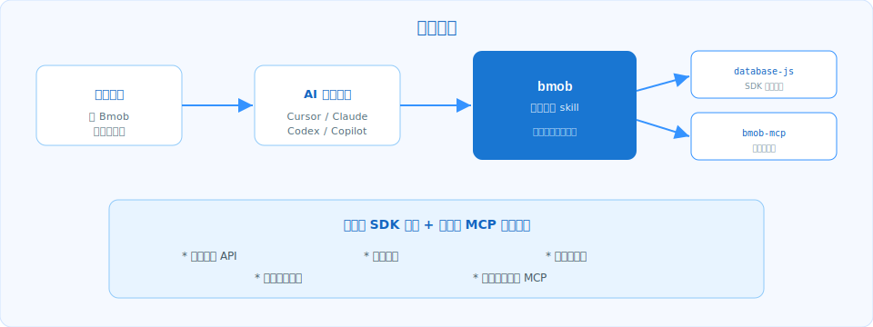

# Bmob Agent Skills

[English](./README.md) | **简体中文**

<p align="center">
  
</p>

> 面向生产实践的 Bmob Agent Skills，适配 Cursor、Claude Code、OpenAI Codex、Gemini CLI、GitHub Copilot 及其他 [agentskills.io](https://agentskills.io/) 兼容工具。

`@bmob/agent-skills` 的目标是让 AI 在 Bmob 场景下“先路由、再编码、可实操、可排障”。它通过平台分流减少 API 混用，通过 MCP 提供真实表结构与数据操作能力，并通过内置安全边界降低密钥误用风险。

<p align="center">
  
</p>

## 为什么用这个项目

- **正确性优先**：先识别平台（JavaScript / Android / iOS / REST），再生成对应代码。
- **可执行能力**：支持 Bmob MCP 实时查表、建表、增删改数据、生成 curl。
- **安全护栏**：skill 中明确了“适用/不适用”边界与密钥使用原则。
- **可维护**：references 与 BmobDocs 同步，配合 CI 校验降低漂移。
- **跨工具复用**：同一份 skill 可在多个 AI 编码宿主中使用。

## 你将获得

<p align="center">
  
</p>

- 总入口：`bmob`
- MCP 实操：`bmob-mcp`（7 个真实工具）
- 开发实现：
  - `bmob-database-javascript`
  - `bmob-database-android`
  - `bmob-database-ios`
  - `bmob-database-restful`
- 排障能力：`bmob-error-codes`

## 快速开始

### 1）一键安装全部 skill（推荐）

```bash
npx skills add bmob/agent-skills -y -g
```

会将 `skills/*` 同步到当前 AI 工具的 skills 目录（例如 `.cursor/skills/`、`.claude/skills/`、`~/.codex/skills/`、`~/.gemini/skills/`）。

### 2）仅安装指定 skill

```bash
npx skills add bmob/agent-skills --skill bmob
npx skills add bmob/agent-skills --skill bmob-database-javascript
npx skills add bmob/agent-skills --skill bmob-mcp
```

### 3）手动安装

```bash
git clone https://github.com/bmob/agent-skills.git
# Cursor（项目级）
cp -r agent-skills/skills/bmob-database-javascript .cursor/skills/
# Claude Code（用户级）
cp -r agent-skills/skills/bmob ~/.claude/skills/
# OpenAI Codex
cp -r agent-skills/skills/bmob-mcp ~/.codex/skills/
```

## 配置 Bmob MCP（可选但推荐）

按 [`shared/mcp-install-snippets.md`](shared/mcp-install-snippets.md) 里的片段配置：

- Cursor：`.cursor/mcp.json` 或 `~/.cursor/mcp.json`
- Claude Code：`.mcp.json` 或 `~/.claude.json`
- OpenAI Codex CLI：`~/.codex/config.toml`
- VS Code / GitHub Copilot：`.vscode/mcp.json`

配置后发送：

```text
列出我 bmob 项目里的所有数据表
```

正常情况下，agent 会调用 `get_project_tables` 返回真实表结构。

> 安全提示：当前 MCP 端点为 `http://mcp.bmobapp.com/mcp`（HTTP 明文），建议仅在本地开发环境使用，且不要提交真实密钥配置。

## 现有 Skills

<p align="center">
  
</p>

| Skill | 作用 |
|---|---|
| [`bmob`](skills/bmob/SKILL.md) | Bmob 场景总入口，负责路由到具体 sub-skill |
| [`bmob-mcp`](skills/bmob-mcp/SKILL.md) | MCP 实时操作：`get_project_tables`、`create_table`、`add_single_data`、`update_single_data`、`delete_single_data`、`generate_code`、`mcp_endpoint_mcp_post` |
| [`bmob-database-javascript`](skills/bmob-database-javascript/SKILL.md) | `hydrogen-js-sdk` 跨端能力（Web/Node/小程序/Cocos Creator JS/Electron/Tauri 等） |
| [`bmob-database-android`](skills/bmob-database-android/SKILL.md) | Android 原生 SDK（Java / Kotlin） |
| [`bmob-database-ios`](skills/bmob-database-ios/SKILL.md) | iOS 原生 SDK（Objective-C / Swift） |
| [`bmob-database-restful`](skills/bmob-database-restful/SKILL.md) | REST API 场景（后端语言与脚本） |
| [`bmob-error-codes`](skills/bmob-error-codes/SKILL.md) | 错误码解释与修复路径建议 |

## 使用示例

| 你说 | 预期激活 |
|---|---|
| “用 Bmob 在 Next.js 里加一条 GameScore” | `bmob` + `bmob-database-javascript` |
| “Android Kotlin 怎么查询 Bmob？” | `bmob` + `bmob-database-android` |
| “Swift 端怎么做 Bmob 登录？” | `bmob` + `bmob-database-ios` |
| “给我一套 Bmob curl 示例” | `bmob` + `bmob-database-restful` |
| “帮我建一个 Player 表” | `bmob` + `bmob-mcp` |
| “9015 错误是什么意思？” | `bmob` + `bmob-error-codes` |

## 项目结构与治理

- **Skill 使用者**：安装后直接使用，不需要接触 BmobDocs 源文档
- **维护者**：维护 skill 内容，按流程提取并更新 references
- **CI**：校验 frontmatter、链接，并在有密钥时执行 MCP smoke test

维护流程见 [CONTRIBUTING.md](CONTRIBUTING.md)。

## 本地开发（维护者）

环境要求：Node.js `>=18`，推荐 `pnpm`。

```bash
git clone --recurse-submodules https://github.com/bmob/agent-skills.git
cd agent-skills
pnpm install
pnpm run validate
```

常用命令：

- `pnpm run validate`：frontmatter 与相对链接校验
- `pnpm run extract:local`：从本地 `vendor/BmobDocs` 提取片段
- `pnpm run extract:remote`：从远端 raw 文档提取片段
- `pnpm run new:skill`：创建新 skill 骨架

## 路线图

- **P0（当前）**：bmob、bmob-mcp、database x 4 端、error-codes
- **P1**：auth x 4、storage x 4、cloud-function x 5、acl-and-roles、bql
- **P2**：push x 4、sms x 2、pay-restful、data-hooks、scheduled-tasks、best-practices

## FAQ

### 需要手动启用 skill 吗？

不需要。skills 会根据 prompt 内容按需自动加载。

### 可以只装一个 skill 吗？

可以。通过 `--skill` 精确安装即可。

### MCP 是必须的吗？

不是。没有 MCP 也能用 SDK/REST skills；但如果你要在 IDE 里做真实表结构与数据操作，推荐配置 MCP。

## 贡献

见 [CONTRIBUTING.md](CONTRIBUTING.md)。

## License

MIT，见 [LICENSE](LICENSE)。
