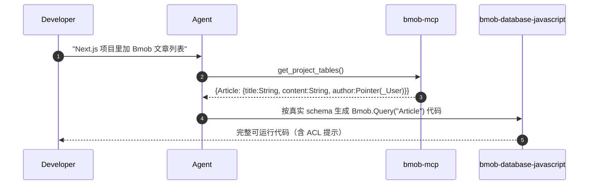

# Bmob Database — JavaScript / 跨端 SDK

[hydrogen-js-sdk](https://github.com/bmob/hydrogen-js-sdk) 是 **同一个 SDK 文件 `Bmob-<version>.min.js`** 支持以下所有宿主环境，无平台分支代码：

- 浏览器 / 任何 Web 前端（React、Vue 2、Vue 3、Next.js、Nuxt、Vite、Astro、SvelteKit、Solid 等）
- Node.js 服务端（必须源码引入）
- 微信小程序 / 支付宝 / 字节跳动 / QQ / 百度 小程序
- 快应用
- Cocos Creator JS
- Electron / Tauri
- 任意混合 App（WebView 内嵌 H5）

> **本 skill 只覆盖新版 hydrogen-js-sdk**（`Bmob.Query('X')` Promise 风格）。基于 Backbone.js 的旧 `bmob-min.js`（`Bmob.Object.extend("X")` callback 风格）与早期 1.x 的 `Application ID + REST API Key` 初始化方式不再支持——**不要用，也不要回退**。

## 核心原则

**1. 初始化只用一种方式：** `Secret Key + API 安全码`（hydrogen-js-sdk 2.0+ 的唯一姿势）。

```js
Bmob.initialize("你的Secret Key", "你的API 安全码");
```

- **Secret Key**：[Bmob 控制台](https://www.bmobapp.com/login) → 应用 → 设置 → 应用密钥 → **Secret Key**。
- **API 安全码**：控制台 → 应用 → 应用功能设置 → 安全验证 → **API 安全码** 自行设置（任意字符串，作为前端"对账盐"使用，不要硬编码到公开 bundle）。

> 旧的 `Bmob.initialize("Application ID","REST API Key")` 调用在 hydrogen-js-sdk 2.x 仍能跑，但功能受限且未来会下线，**禁止生成这种代码**。

**2. 不要 commit 真实密钥进 git；CDN / dist 不要写死 SDK 版本号。** 密钥用环境变量（Vite `import.meta.env.VITE_BMOB_*`、Next.js `process.env.NEXT_PUBLIC_BMOB_*`、小程序构建期注入等）。dist 文件名为 `Bmob-<version>.min.js`，有打包工具时用 `npm install hydrogen-js-sdk`；纯 CDN 浏览器场景用 jsDelivr API 动态取 `tags.latest` 再拼 URL（见 [`references/platform-init.md`](references/platform-init.md)）。**禁止**在示例里写 `@2.7.3` 这类会过期的具体版本。

**3. 默认查询返回 100 条**，最大 1000。需要更多用 `skip + limit` 分页或走 BQL（`bmob-bql` skill）。

**4. 三个保留字段不能手动写入**：`objectId`、`createdAt`、`updatedAt`。读 objectId 时用 `res.objectId`（不是 `id`）。

**5. 时间字段比较的精度**：`createdAt` / `updatedAt` 在服务器是微秒精度，应用层做时间比较时要 +1 秒。

## 安全清单

- [ ] **密钥分级**：浏览器 / 小程序 / 移动端只用 Secret Key + API 安全码，**永不用 Master Key**。Master Key 仅服务端使用。
- [ ] **生产环境关闭调试模式**：`Bmob.debug(true)` 仅在小程序开发时使用，上线前删掉。
- [ ] **小程序必须配置服务器域名白名单**：见 [`references/platform-init.md`](references/platform-init.md) 微信小程序段。
- [ ] **写入的表必须配 ACL**：否则任意用户可改任意行。参见 `bmob-acl-and-roles`（P1）。
- [ ] **批量操作上限 50 条**（含批量更新、批量删除）。超出需循环。
- [ ] **批量查询上限 100 条 / 单次 1000 条**：避免一次拉全表。
- [ ] **`Bmob.User.login` 在小程序里要先调用 `wx.login()`** 获取 code，否则会话拿不到 sessionToken。

## 快速开始（80% 场景就这么写）

### 初始化

```js
import Bmob from "hydrogen-js-sdk";
Bmob.initialize("你的Secret Key", "你的API 安全码");
```

详细的 8 种宿主环境引入方式见 [`references/platform-init.md`](references/platform-init.md)。

### 新增一行

```js
const query = Bmob.Query("GameScore");
query.set("score", 1337);
query.set("playerName", "bmob");
query.set("cheatMode", false);
query.save().then((res) => {
  console.log(res.objectId, res.createdAt);
});
```

### 通过 objectId 取一行

```js
const query = Bmob.Query("GameScore");
query.get("7ecd253a25").then((res) => {
  console.log(res);
});
```

### 修改一行

```js
const query = Bmob.Query("GameScore");
query.set("id", "7ecd253a25");          // 注意 set("id", objectId)
query.set("score", 9999);
query.save().then((res) => {
  console.log(res.updatedAt);
});
```

### 删除一行

```js
const query = Bmob.Query("GameScore");
query.destroy("7ecd253a25").then((res) => {
  console.log(res);                      // { msg: "ok" }
});
```

### 删除某个字段的值

```js
const query = Bmob.Query("GameScore");
query.get("7ecd253a25").then((res) => {
  res.unset("cover");
  res.save();
});
```

### 查询全部（默认 100 条）

```js
const query = Bmob.Query("GameScore");
query.find().then((res) => {
  console.log(res);
});
```

### 条件查询

`equalTo(field, op, value)`，`op` 可以是 `"=="` / `"!="` / `">"` / `">="` / `"<"` / `"<="`。

```js
const query = Bmob.Query("GameScore");
query.equalTo("score", ">", 100);
query.equalTo("cheatMode", "==", false);   // 多个条件 = AND
query.limit(20);
query.skip(0);
query.order("-score");                      // 降序
query.find().then(console.log);
```

### 或查询（OR）

```js
const query = Bmob.Query("GameScore");
const q1 = query.equalTo("score", ">", 150);
const q2 = query.equalTo("score", "<", 5);
query.or(q1, q2);
query.find().then(console.log);
```

### 只取部分字段

```js
const query = Bmob.Query("Post");
query.select("title");
query.find().then(console.log);
```

### 集合查询

```js
query.containedIn("playerName", ["Bmob", "Codenow", "JS"]);
query.notContainedIn("playerName", ["spam"]);
query.exists("score");           // 含此字段
query.doesNotExist("score");     // 不含此字段
```

### 统计

```js
const query = Bmob.Query("diary");
query.count().then((n) => console.log(`共 ${n} 条`));
query.count(100).then((arr) => console.log("最多返回 100 条记录数据 + count"));
```

### 原子计数器

```js
const query = Bmob.Query("Post");
query.get("objectId").then((res) => {
  res.increment("likes");        // +1
  res.increment("likes", 5);     // +5（支持负数）
  res.save();
});
```

### 数组字段

```js
const query = Bmob.Query("Diary");
query.add("DiaryType", ["public"]);          // 末尾追加
query.addUnique("DiaryType", ["secret"]);    // 去重追加
query.save();

query.get("objectId").then((res) => {
  res.remove("DiaryType", ["secret"]);       // 删除元素
  res.save();
});
```

## 进阶能力（按需读 references/）

| 主题 | 路径 |
|---|---|
| 8 种宿主环境的初始化差异（浏览器 / Node / 微信/支付宝/字节/QQ/百度小程序 / 快应用 / Cocos Creator / Electron） | [`references/platform-init.md`](references/platform-init.md) |
| Pointer / Relation 一对多 / 多对多 | [`references/pointer-and-relation.md`](references/pointer-and-relation.md) |
| 复杂子查询（`$inQuery` / `$notInQuery`）、模糊查询、地理位置查询 | [`references/query.md`](references/query.md) |
| 实时数据订阅（仅小程序 / Web）+ WebSocket | [`references/realtime.md`](references/realtime.md) |
| 批量操作（≤ 50） | [`references/batch.md`](references/batch.md) |

## 与 MCP 联动

如果用户在 IDE 里配置了 [Bmob MCP](../bmob-mcp/SKILL.md)，**写代码前先调用 `get_project_tables`** 拿到真实 schema，避免：

- 字段名拼错（schemaless 不报错，数据进库后再排查很慢）
- Pointer 字段类型用错（必须是 `{"__type":"Pointer","className":"X","objectId":"..."}`）
- 把保留字段当业务字段写



## 排错速查

| 现象 | 排查 |
|---|---|
| `Bmob is undefined` | 没引入 SDK；或 Node.js 用了压缩版（必须用源码 `require('hydrogen-js-sdk/src/lib/app.js')`） |
| 初始化报 401 | Secret Key 拼错；或把 Application ID / REST API Key 当 Secret Key 传了；或 API 安全码与控制台不一致 |
| 写入成功但字段值不见 | 字段名拼错（schemaless 不报错）；先 `get_project_tables` 比对 |
| 查询返回数据少 | 默认 100 条上限；用 `query.limit(1000)` 或分页 |
| `set("id", ...)` 没生效 | 更新时必须用 `set("id", objectId)`（不是 `set("objectId", ...)`） |
| 时间范围查询少一条 | 服务端时间是微秒精度，区间右端 +1 秒 |
| 小程序请求失败 | 没在小程序后台配置 https 服务器域名白名单 |
| Promise 一直 pending | 调用了不存在的方法名（hydrogen 不抛错只挂起）；对照 [完整 API](https://github.com/bmob/BmobDocs/blob/master/mds/data/wechat_app_new/index.md) |
| 9015 报错 | 见 [`bmob-error-codes`](../bmob-error-codes/SKILL.md) 的 9015 专题 |

## 参考

- 完整 API：[BmobDocs/mds/data/wechat_app_new/index.md](https://github.com/bmob/BmobDocs/blob/master/mds/data/wechat_app_new/index.md) — 跨端 hydrogen-js-sdk 主文档
- 旧版 API 参考（仍在线）：[BmobDocs/mds/data/javascript/develop_doc.md](https://github.com/bmob/BmobDocs/blob/master/mds/data/javascript/develop_doc.md)
- SDK 源码：<https://github.com/bmob/hydrogen-js-sdk>
- 错误码：[`bmob-error-codes`](../bmob-error-codes/SKILL.md)
- MCP 联动：[`bmob-mcp`](../bmob-mcp/SKILL.md)
