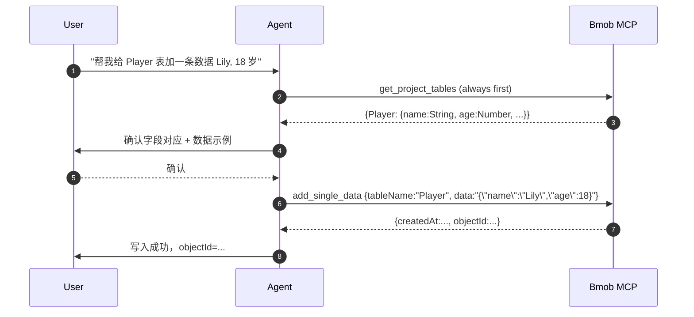

# Bmob MCP Server

Bmob 官方托管的 MCP 服务器，端点 `http://mcp.bmobapp.com/mcp`，传输是 MCP 2024-11-05 的 HTTP+SSE。通过 `X-Bmob-Application-Id` + `X-Bmob-REST-API-Key` 两个 HTTP 头部鉴权，agent 配置好后即可在 IDE 内对你的真实 Bmob 项目进行增删改查、设计 schema、生成 curl 样板。

> **HTTP 明文警告**：当前 MCP 端点是 HTTP（非 HTTPS）。仅建议在本机开发环境使用；请勿把含真实 Key 的 `.cursor/mcp.json` / `.mcp.json` 提交进公开 git 仓库。

## 何时用 MCP vs 何时用 SDK skill

| 场景 | 走 MCP | 走 SDK skill |
|---|---|---|
| 想知道项目里有哪些表、字段是什么类型 | ✅ `get_project_tables` | — |
| 设计新表 / 增字段 / 改 schema | ✅ `create_table` | — |
| 在 IDE 里测试增删改查（开发期手工触发） | ✅ `add_single_data` / `update_single_data` / `delete_single_data` | — |
| 想要任意语言的 curl 样板（备份、迁移脚本） | ✅ `generate_code` | — |
| 写到 app 里要发布的代码（生产代码） | — | ✅ `bmob-database-{javascript,android,ios,restful}` |
| 配 ACL / 权限规则 | — | ✅ `bmob-acl-and-roles` |
| 写运行在 Bmob 服务器上的云函数 | — | ✅ `bmob-cloud-function-development` |

## 安装

把以下任一片段复制到对应工具的 MCP 配置文件，详细见 [`shared/mcp-install-snippets.md`](../../shared/mcp-install-snippets.md)：

```json
{
  "mcpServers": {
    "bmob": {
      "url": "http://mcp.bmobapp.com/mcp",
      "headers": {
        "X-Bmob-Application-Id": "<your-application-id>",
        "X-Bmob-REST-API-Key":   "<your-rest-api-key>"
      }
    }
  }
}
```

凭证位置：[Bmob 控制台](https://www.bmobapp.com/login) → 你的应用 → 设置 / 应用密钥。

## 强制工作流

**任何写操作前必须先调用 `get_project_tables`** 拿到当前项目的真实表结构，禁止凭推测生成字段名 / 类型。这是因为：

1. Bmob 是 schemaless 的——`add_single_data` 接受任意 JSON，错字段会直接进库导致脏数据。
2. `Pointer` / `Relation` 字段必须传 `{ "__type":"Pointer", "className":"X", "objectId":"..." }` 格式，写错会被静默忽略。



## 7 个工具的真实 schema（从 `tools/list` 返回直接保留）

### 1. `get_project_tables`

获取这个项目的所有表和对应的字段结构。**除 headers 之外不需要传任何参数**。**所有写操作前必须先调用一次**。

```json
{
  "inputSchema": {
    "type": "object",
    "properties": {},
    "title": "get_project_tablesArguments"
  }
}
```

### 2. `create_table`

创建新的数据表。

```json
{
  "inputSchema": {
    "type": "object",
    "properties": {
      "tableName": { "type": "string" },
      "classNote": { "type": "string" },
      "fields":    { "type": "string", "description": "JSON-encoded field map" }
    }
  }
}
```

**`fields` 是 JSON 字符串**，示例：

```json
{
  "score":    { "type": "Number",  "isAutoIncre": true, "autoIncreInit": 1000, "note": "游戏分数" },
  "player":   { "type": "Pointer", "targetClass": "Player",                    "note": "玩家" },
  "nickname": { "type": "String",  "unique": true,                             "note": "昵称" }
}
```

`type` 是 10 个枚举值之一：

| type | 说明 | 额外约束 |
|---|---|---|
| `String` | 字符串 | `unique: true` 可设唯一键 |
| `Number` | 整数 / 小数 | `isAutoIncre: true` + `autoIncreInit: <int>` 可设自增 |
| `Bool` | 布尔 | — |
| `Date` | 日期 | — |
| `File` | 文件 | 关联 Bmob 文件系统的 url + filename |
| `Geo` | 地理位置 | latitude + longitude |
| `Array` | 数组 | — |
| `Object` | 嵌套对象 | — |
| `Pointer` | 一对多指针 | 必填 `targetClass: "<TableName>"` |
| `Relation` | 多对多关联 | 必填 `targetClass: "<TableName>"` |

**重要**：`createdAt` / `updatedAt` / `objectId` / `ACL` 是 Bmob 内置字段，**不要**在 `fields` 里声明它们。

### 3. `add_single_data`

给指定表添加一行数据。

```json
{
  "inputSchema": {
    "type": "object",
    "required": ["tableName", "data"],
    "properties": {
      "tableName": { "type": "string" },
      "data":      { "type": "string", "description": "JSON-encoded row" }
    }
  }
}
```

`data` 是 JSON 字符串，例：`'{"score":1337,"playerName":"bmob","cheatMode":false}'`。Pointer 字段用：

```json
{ "player": { "__type": "Pointer", "className": "Player", "objectId": "abc123" } }
```

### 4. `update_single_data`

更新某行数据。**会用入参 `data` 整体替换给定字段**（不是 patch）。

```json
{
  "inputSchema": {
    "type": "object",
    "required": ["tableName", "objectId", "data"],
    "properties": {
      "tableName": { "type": "string" },
      "objectId":  { "type": "string" },
      "data":      { "type": "string" }
    }
  }
}
```

### 5. `delete_single_data`

删除某表中指定 objectId 的一行。**不可逆**，调用前必须经用户二次确认。

```json
{
  "inputSchema": {
    "type": "object",
    "required": ["tableName", "objectId"],
    "properties": {
      "tableName": { "type": "string" },
      "objectId":  { "type": "string" }
    }
  }
}
```

### 6. `generate_code`

生成对应操作的 Bmob curl，便于客户端把 curl 翻译成任意开发语言。**调用前必须先调用 `get_project_tables`**。`type` 是 13 个枚举值，每种 type 需要的参数子集不同：

| `type` 取值 | 必填参数 |
|---|---|
| `添加` | `tableName`, `data` |
| `删除` | `tableName`, `objectId` |
| `更新` | `tableName`, `objectId`, `data` |
| `查询一条数据` | `tableName`, `objectId` |
| `条件查询` | `tableName`, `where`（JSON 字符串）, `skip`, `limit`, `count` |
| `注册` | `data`（必含 `username` + `password`） |
| `用户名密码登录` | `username`, `password` |
| `手机号验证码登录` | `mobilePhoneNumber`, `smsCode` |
| `更新用户` | `sessionToken`, `objectId`, `data` |
| `请求短信验证码` | `data`（必含 `mobilePhoneNumber` + `template`） |
| `验证短信验证码` | `data`（必含 `mobilePhoneNumber`）, `smsCode` |
| `调用云函数` | `funcName`, `data` |
| `上传文件` | `fileName`, `content_Type` |

完整 `inputSchema`：

```json
{
  "inputSchema": {
    "type": "object",
    "required": ["type", "objectId", "data", "tableName", "where"],
    "properties": {
      "type":              { "type": "string" },
      "objectId":          { "type": "string" },
      "data":              { "type": "string" },
      "tableName":         { "type": "string" },
      "where":             { "type": "string" },
      "skip":              { "type": "integer" },
      "limit":             { "type": "integer" },
      "count":             { "type": "integer" },
      "fileName":          { "type": "string" },
      "content_Type":      { "type": "string" },
      "username":          { "type": "string" },
      "password":          { "type": "string" },
      "mobilePhoneNumber": { "type": "string" },
      "smsCode":           { "type": "string" },
      "sessionToken":      { "type": "string" },
      "funcName":          { "type": "string" }
    }
  }
}
```

`where` 示例：`'{"age":{"$gte":18}}'` 等同 SQL `WHERE age >= 18`。完整 where 语法见 [REST 文档 #_24](https://github.com/bmob/BmobDocs/blob/master/mds/data/restful/develop_doc.md)。

### 7. `mcp_endpoint_mcp_post`

服务器内部回环端点，**不要主动调用**。

## 安全清单

- [ ] **配置文件不入 git**：`.cursor/mcp.json` / `.mcp.json` / `~/.codex/config.toml` 若含真实 Key，必须在 `.gitignore` 排除。
- [ ] **`delete_single_data` 与 `update_single_data` 必须二次确认**：这两个工具不可逆，agent 在执行前要把目标 objectId 与数据 diff 展示给用户审视。
- [ ] **不要在 `create_table.fields` 里写 `createdAt` / `updatedAt` / `objectId` / `ACL`**——这些字段 Bmob 已内置。
- [ ] **写入前一定先 `get_project_tables`**：跳过这步会让 schemaless 的 Bmob 接受错字段，污染数据。
- [ ] **当前 MCP 端点是 HTTP 明文**：Header 里的 REST API Key 在传输中可被嗅探。不要在公共 WiFi 调用。
- [ ] **MCP 是开发期工具**：不要把"agent → MCP"的链路嵌进生产应用，生产代码请用 SDK。

## 常见错误

| 表现 | 原因 | 修复 |
|---|---|---|
| `tools/list` 报 `-32602 Invalid request parameters` | 没有先 `initialize` + `notifications/initialized` 握手 | MCP client 默认会做，手测可参考下方诊断片段 |
| Header 401 / 403 | App ID 或 REST API Key 写错；或者 App ID 与 Key 不属于同一应用 | 控制台重取，注意"测试环境 / 生产环境"密钥不同 |
| `add_single_data` 成功但数据不出现 | 字段名拼错（schemaless 不报错） | 先 `get_project_tables` 拿真实字段名 |
| Pointer 字段不生效 | 传成了字符串 objectId | 改用 `{"__type":"Pointer","className":"X","objectId":"..."}` |

## 诊断片段（手测 SSE 连接）

仅供开发者验证 MCP 服务器连通性使用，正常情况下 agent 自动处理。

```bash
# 1. 拿 session 端点
curl -s -N 'http://mcp.bmobapp.com/mcp' \
  -H 'Accept: text/event-stream' \
  -H 'X-Bmob-Application-Id: <id>' \
  -H 'X-Bmob-REST-API-Key: <key>' &

# 2. SSE 立刻吐出第一帧 event: endpoint，里面有 session_id
# event: endpoint
# data: /mcp/messages/?session_id=xxx

# 3. POST initialize / notifications/initialized / tools/list 到该 session
curl -s -X POST 'http://mcp.bmobapp.com/mcp/messages/?session_id=xxx' \
  -H 'Content-Type: application/json' \
  -H 'X-Bmob-Application-Id: <id>' \
  -H 'X-Bmob-REST-API-Key: <key>' \
  -d '{"jsonrpc":"2.0","id":1,"method":"initialize","params":{"protocolVersion":"2024-11-05","capabilities":{},"clientInfo":{"name":"smoke","version":"0.0.1"}}}'
```

## 参考

- [Bmob MCP 介绍页](https://www.bmobapp.com/mcp)
- [shared/mcp-install-snippets.md](../../shared/mcp-install-snippets.md) — 五种 IDE 的配置模板
- [REST API 完整文档](https://github.com/bmob/BmobDocs/blob/master/mds/data/restful/develop_doc.md) — `generate_code` 生成的 curl 形态对应这里
- 错误码字典：[`bmob-error-codes`](../bmob-error-codes/SKILL.md)
