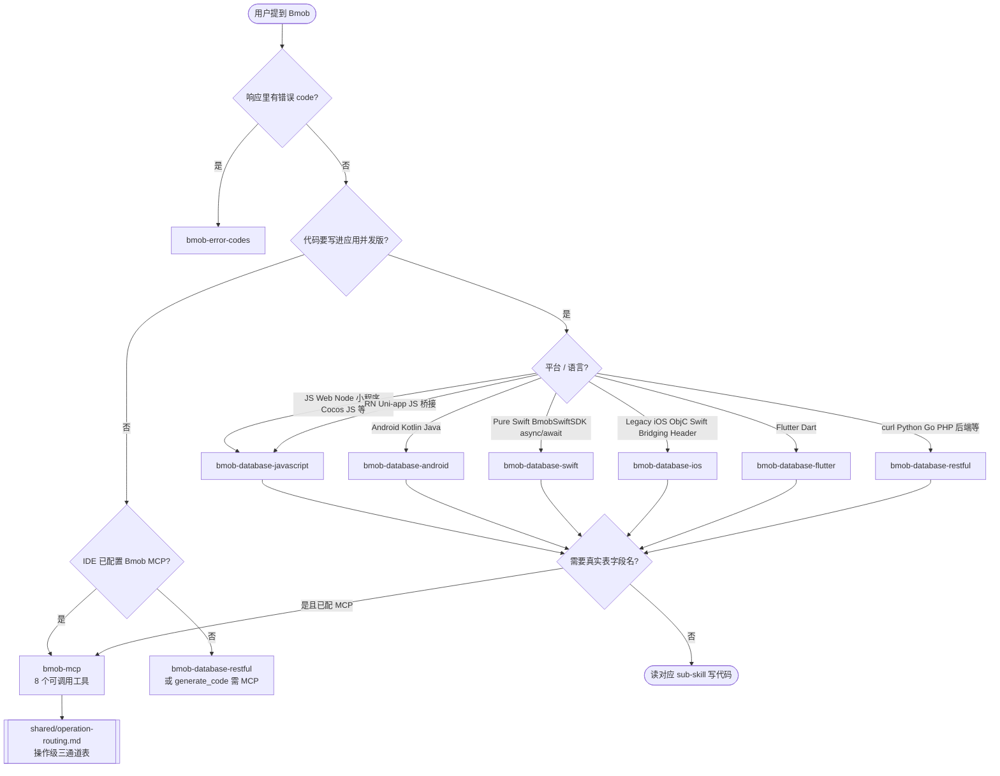
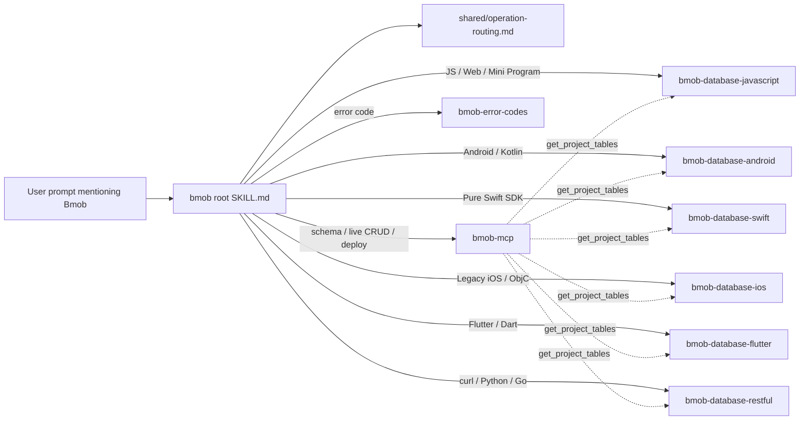

# Bmob 后端云 — 总入口

[Bmob](https://www.bmobapp.com/) 是一个 BaaS（Backend as a Service）平台，提供 NoSQL 数据库、用户系统、文件存储、云函数、推送、短信、支付、IM、AI 等开箱即用的后端能力。客户端覆盖 JavaScript / Android / iOS / Swift / Flutter / HarmonyOS / 小程序 / Python / Go / PHP / C#，加上语言无关的 [REST API](https://github.com/bmob/BmobDocs/blob/master/mds/data/restful/develop_doc.md) 与 [MCP Server](http://mcp.bmobapp.com/mcp)。

**路由顺序**：先走下方 **入口决策树** → 再查 **路由决策表**（选 sub-skill）→ 具体操作查 **[`shared/operation-routing.md`](../../shared/operation-routing.md)**（MCP / curl / SDK·REST 三通道对照）。

## 核心原则

**1. 永远先确认平台再写代码。** Bmob 各端 SDK 的 API 形态差异很大（JS 是 `Bmob.Query`、Android 是 `extends BmobObject`、旧 iOS 是 `BmobObject objectWithClassName`、纯 Swift 是 `try await BmobObject.save()`、REST 是 HTTP `/1/classes/<name>`），不要把 JS 的代码塞进 Android skill 的回答里。先看用户用什么平台 / 框架，再读对应 sub-skill。

**2. 不要在前端泄漏 Master Key。** Bmob 控制台 → 应用密钥里有四个值：

| 密钥 | 安全级别 | 使用场景 |
|---|---|---|
| Application ID | 公开 | 所有端 |
| REST API Key | 半公开 | 浏览器 / 小程序 / 移动端 / 服务端 |
| Secret Key | 中等 | 加密授权场景的客户端，配合 SecurityCode |
| Master Key | **最高** | 仅服务端 / 后台脚本，**永不出现在前端 bundle** |

**3. 写之前先看 changelog。** SDK 在演进，方法签名会变。开始一项任务前用 raw URL 拉对应平台的 `update_log.md`（路径见 sub-skill 的 `metadata.docs_raw`）确认无破坏性变更。

**4. 错误不要循环重试。** 2-3 次同样的尝试失败后停下，重新评估：

- HTTP 4xx：先把响应体里的 `code` 拿去查 [`bmob-error-codes`](../bmob-error-codes/SKILL.md)。
- 权限/ACL 报错（9015、9016 等）：见下方 **P1 临时路径** 或将来 `bmob-acl-and-roles`。
- "找不到方法"：可能 SDK 版本过旧或文档与你使用版本不匹配，去仓库 release 页对比。

## 入口决策树（先走这里）



## 路由决策表（命中后立即去读对应 sub-skill）

| 用户意图 | 平台线索 | 路由到 |
|---|---|---|
| 新建/查看表结构、加测试数据、生成 curl 样板、实操数据库 | — | `bmob-mcp`（前提：用户已配置 MCP） |
| **一键部署网站 / 静态托管**（HTML 或 dist 到 CDN） | — | `bmob-mcp` → **`deploy_static_site`**（或 `generate_code` 仅生成 curl） |
| NoSQL 增删改查、条件查询 | JS / TS / Web / Node / 微信/支付宝/字节/QQ/百度小程序 / 快应用 / Cocos Creator JS / Electron / Tauri / 混合 App | `bmob-database-javascript` |
| NoSQL 增删改查 | Android / Kotlin / Java | `bmob-database-android` |
| NoSQL 增删改查 | **纯 Swift SDK** / `BmobSwiftSDK` / SPM / `import BmobSDK` / `async/await` | **`bmob-database-swift`** |
| NoSQL 增删改查 | 旧 iOS SDK / Objective-C / Swift Bridging Header / `BmobSDK.xcframework` / `saveInBackground` | `bmob-database-ios` |
| NoSQL 增删改查 | **Flutter / Dart**（`bmob_plugin`） | **`bmob-database-flutter`** |
| NoSQL 增删改查 / 任意没 SDK 的语言 | curl / Python / Go / PHP / C# / Rust / Ruby / Java 后端 | `bmob-database-restful` |
| React Native / Uni-app（JS 层接 Bmob） | — | `bmob-database-javascript` 或 REST |
| HarmonyOS ArkTS | — | `bmob-database-restful` + [BmobDocs](https://github.com/bmob/BmobDocs) |
| 用户注册 / 登录 / SMS 验证 / 三方登录 / 邮箱验证 | 各端 | `bmob-auth-{platform}`（P1，见下表） |
| 文件上传下载 / CDN | 各端 | `bmob-storage-{platform}`（P1，见下表） |
| 调用云函数 | 各端 | `bmob-cloud-function-{platform}`（P1，见下表） |
| 编写运行在 Bmob 服务器上的云函数代码 | — | `bmob-cloud-function-development`（P1，见下表） |
| ACL / 角色 / 权限 / 行级安全 | — | `bmob-acl-and-roles`（P1，见下表） |
| BQL 查询（类 SQL 语法） | 任意 | `bmob-bql`（P1，见下表） |
| 排查报错 code 9015 / 101 / 105 等 | — | `bmob-error-codes` |
| 推送 / 短信 / 支付 | 各端 | `bmob-push-*` / `bmob-sms-*` / `bmob-pay-*`（P2） |

具体操作（增删改查、登录、上传、部署）用哪条通道，见 **[`shared/operation-routing.md`](../../shared/operation-routing.md)**。

## P1 / P2 尚未发布时的临时路径

专用 sub-skill 未安装时，**不要空等**，按此表降级：

| 用户意图 | 目标 skill（未发布） | 当前可用替代 |
|---|---|---|
| 注册 / 登录 / 短信验证码 | `bmob-auth-*` | REST：[`bmob-database-restful/references/users.md`](../bmob-database-restful/references/users.md)；已配 MCP：`generate_code`（`注册` / `用户名密码登录` / `手机号验证码登录` 等） |
| 文件上传 / CDN URL | `bmob-storage-*` | REST：[`references/files.md`](../bmob-database-restful/references/files.md)；MCP：`generate_code` → `上传文件` |
| 调用已有云函数 | `bmob-mcp` → **`invoke_cloud_function`**（执行）；`generate_code` → `调用云函数`（curl） | REST `/1/functions/<name>`；各端 SDK |
| 编写并部署云函数源码 | `bmob-cloud-function-development` | [BmobDocs 云函数](https://github.com/bmob/BmobDocs/tree/master/mds) + 控制台 |
| ACL / 行级权限 / 9015·9016 | `bmob-acl-and-roles` | REST 创建/更新 body 内 `"ACL":{...}`；[`bmob-error-codes`](../bmob-error-codes/SKILL.md) |
| BQL / 跨表聚合 | `bmob-bql` | REST `GET /1/cloudQuery`；[`bmob-database-restful`](../bmob-database-restful/SKILL.md) |
| 推送 / 短信 / 支付 | P2 skills | REST 对应模块 + BmobDocs `mds` 目录树 |

## 通用安全清单（被所有 sub-skill include）

- [ ] 写入操作的目标表必须配 ACL，否则任意用户可改任意行（参见 P1 临时路径中的 ACL 行）。
- [ ] 浏览器 / 小程序 / 移动端可用 **REST API Key（简易授权 / SDK 方式 B）** 或 **Secret Key + 安全码（加密授权 / SDK 方式 A）**；**绝不**使用 Master Key。
- [ ] 加密授权场景的 `SecurityCode` 不通过网络传输；不要硬编码到前端 bundle，用环境变量注入或放进 BFF。
- [ ] 凡是 batch / 全表扫描 / 跨表查询 → 优先用 BQL 而不是循环调用 SDK。
- [ ] 出错时先看响应体里的 `code` 字段去查 `bmob-error-codes`，不要乱猜。
- [ ] 用户密码字段（`password`）只能由 Bmob 写入，不能 update；如需改密走 `/1/updateUserPassword/<objectId>`。

## FAQ 与反模式

- **跨平台常见问题**（路由、密钥、MCP、数据格式）：[`shared/faq.md`](../../shared/faq.md)
- **典型反模式**（ACL、Master Key、9015 误用等）：[`shared/anti-patterns.md`](../../shared/anti-patterns.md)
- **按英文 error 反查数字码**：[`bmob-error-codes`](../bmob-error-codes/SKILL.md) 顶部「按现象反查」表

## 应用场景食谱

端到端场景（表设计 + ACL + 流程），再进各 platform skill 写代码：

| 场景 | 食谱 |
|------|------|
| 博客 / CMS（Article + Author） | [`shared/recipes/blog-cms.md`](../../shared/recipes/blog-cms.md) |
| 用户自有 Todo（行级 ACL） | [`shared/recipes/user-owned-todos.md`](../../shared/recipes/user-owned-todos.md) |
| 微信小程序登录 | [`shared/recipes/mini-program-login.md`](../../shared/recipes/mini-program-login.md) |
| 头像上传 | [`shared/recipes/avatar-upload.md`](../../shared/recipes/avatar-upload.md) |
| 服务端批量迁移 | [`shared/recipes/server-migration.md`](../../shared/recipes/server-migration.md) |
| 静态站 MCP 部署 | [`shared/recipes/static-site-deploy.md`](../../shared/recipes/static-site-deploy.md) |

## 文档查找方法

各 sub-skill 的 **`references/snippets/`**（由 BmobDocs 同步提交）与手写 **`references/*.md`** 覆盖大部分 API。仍不够时再 fetch 上游文档：

1. **按文件名定位**：上游文档树在 [github.com/bmob/BmobDocs/tree/master/mds](https://github.com/bmob/BmobDocs/tree/master/mds)，按 `<feature>/<platform>/` 组织。
2. **agent 直接 fetch**（绕过 GitHub 渲染层）：

   ```
   https://raw.githubusercontent.com/bmob/BmobDocs/master/mds/<feature>/<platform>/<filename>.md
   ```

   已验证可被 WebFetch 工具直接拉为纯 markdown。
3. **列目录**（不知道文件名时）：

   ```
   https://api.github.com/repos/bmob/BmobDocs/contents/mds/<feature>/<platform>
   ```
4. **仍找不到**：去 <https://www.bmobapp.com/docs/>。

## 与 MCP 的协作（关键）

如果用户在 IDE 里配置了 Bmob MCP Server（见 [`shared/mcp-install-snippets.md`](../../shared/mcp-install-snippets.md)），任何涉及「读真实表结构 / 写测试数据 / 设计 schema / 生成样板 curl / **一键部署网站**」的任务都应 **优先 MCP**，不要凭猜测写字段名。

- **`tools/list` 共 9 个工具**；agent **只调用其中 8 个**（`get_project_tables`、`create_table`、`add_single_data`、`update_single_data`、`delete_single_data`、`generate_code`、`invoke_cloud_function`、`deploy_static_site`）。
- **`mcp_endpoint_mcp_post`** 为服务端内部回环，**不要调用**。
- 工具参数与话术对照：[`bmob-mcp`](../bmob-mcp/SKILL.md)；操作级三通道表：[`shared/operation-routing.md`](../../shared/operation-routing.md)。



## 一句话总结

> 用户提到 Bmob → 读本 skill 的 **入口决策树** → **路由决策表** 选 sub-skill → **[`shared/operation-routing.md`](../../shared/operation-routing.md)** 选 MCP / curl / SDK·REST；端特化代码在 sub-skill 的 `references/` 与 SKILL.md 里。
