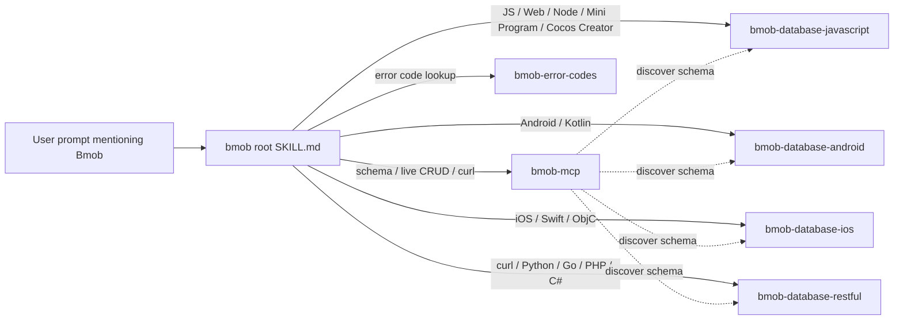

# Bmob 后端云 — 总入口

[Bmob](https://www.bmobapp.com/) 是一个 BaaS（Backend as a Service）平台，提供 NoSQL 数据库、用户系统、文件存储、云函数、推送、短信、支付、IM、AI 等开箱即用的后端能力。客户端覆盖 JavaScript / Android / iOS / Flutter / HarmonyOS / 小程序 / Python / Go / PHP / C#，加上语言无关的 [REST API](https://github.com/bmob/BmobDocs/blob/master/mds/data/restful/develop_doc.md) 与 [MCP Server](http://mcp.bmobapp.com/mcp)。

## 核心原则

**1. 永远先确认平台再写代码。** Bmob 各端 SDK 的 API 形态差异很大（JS 是 `Bmob.Object.extend`、Android 是 `extends BmobObject`、iOS 是 `BmobObject objectWithClassName`、REST 是 HTTP `/1/classes/<name>`），不要把 JS 的代码塞进 Android skill 的回答里。先看用户用什么平台 / 框架，再读对应 sub-skill。

**2. 不要在前端泄漏 Master Key。** Bmob 控制台 → 应用密钥里有四个值：

| 密钥 | 安全级别 | 使用场景 |
|---|---|---|
| Application ID | 公开 | 所有端 |
| REST API Key | 半公开 | 浏览器 / 小程序 / 移动端 / 服务端 |
| Secret Key | 中等 | 加密授权场景的客户端，配合 SecurityCode |
| Master Key | **最高** | 仅服务端 / 后台脚本，**永不出现在前端 bundle** |

**3. 写之前先看 changelog。** SDK 在演进，方法签名会变。开始一项任务前用 raw URL 拉对应平台的 `update_log.md`（路径见 sub-skill 的 `metadata.docs_raw`）确认无破坏性变更。

**4. 错误不要循环重试。** 2-3 次同样的尝试失败后停下，重新评估：

- HTTP 4xx：先把响应体里的 `code` 拿去查 [`bmob-error-codes`](../bmob-error-codes/SKILL.md)。
- 权限/ACL 报错（9015、9016 等）：去看 `bmob-acl-and-roles`。
- "找不到方法"：可能 SDK 版本过旧或文档与你使用版本不匹配，去仓库 release 页对比。

## 路由决策表（命中后立即去读对应 sub-skill）

| 用户意图 | 平台线索 | 路由到 |
|---|---|---|
| 新建/查看表结构、加测试数据、生成 curl 样板、实操数据库 | — | `bmob-mcp`（前提：用户已配置 MCP） |
| NoSQL 增删改查、条件查询 | JS / TS / Web / Node / 微信/支付宝/字节/QQ/百度小程序 / 快应用 / Cocos Creator / Electron / Tauri / 混合 App | `bmob-database-javascript`（跨端 hydrogen-js-sdk） |
| NoSQL 增删改查 | Android / Kotlin / Java | `bmob-database-android` |
| NoSQL 增删改查 | iOS / Swift / Objective-C | `bmob-database-ios` |
| NoSQL 增删改查 / 任意没 SDK 的语言 | curl / Python / Go / PHP / C# / Rust / Ruby / Java 后端 | `bmob-database-restful` |
| 用户注册 / 登录 / SMS 验证 / 三方登录 / 邮箱验证 | 各端 | `bmob-auth-{platform}`（P1） |
| 文件上传下载 / CDN | 各端 | `bmob-storage-{platform}`（P1） |
| 调用云函数 | 各端 | `bmob-cloud-function-{platform}`（P1） |
| 编写运行在 Bmob 服务器上的云函数代码 | — | `bmob-cloud-function-development`（P1） |
| ACL / 角色 / 权限 / 行级安全 | — | `bmob-acl-and-roles`（P1） |
| BQL 查询（类 SQL 语法） | 任意 | `bmob-bql`（P1） |
| 排查报错 code 9015 / 101 / 105 等 | — | `bmob-error-codes` |
| 推送 / 短信 / 支付 | 各端 | `bmob-push-*` / `bmob-sms-*` / `bmob-pay-*`（P2） |

> 标 `(P1)` / `(P2)` 的尚未发布；遇到这些意图但 sub-skill 缺失时，先用 `bmob-database-restful` 的通用 REST 方法对应模块（用户系统、文件等都有对应 endpoint），再追踪上游 [BmobDocs](https://github.com/bmob/BmobDocs)。

## 通用安全清单（被所有 sub-skill include）

- [ ] 写入操作的目标表必须配 ACL，否则任意用户可改任意行（参见 `bmob-acl-and-roles`）。
- [ ] 浏览器 / 小程序 / 移动端可用 **REST API Key（简易授权 / SDK 方式 B）** 或 **Secret Key + 安全码（加密授权 / SDK 方式 A）**；**绝不**使用 Master Key。
- [ ] 加密授权场景的 `SecurityCode` 不通过网络传输；不要硬编码到前端 bundle，用环境变量注入或放进 BFF。
- [ ] 凡是 batch / 全表扫描 / 跨表查询 → 优先用 BQL 而不是循环调用 SDK。
- [ ] 出错时先看响应体里的 `code` 字段去查 `bmob-error-codes`，不要乱猜。
- [ ] 用户密码字段（`password`）只能由 Bmob 写入，不能 update；如需改密走 `/1/updateUserPassword/<objectId>`。

## 文档查找方法

skill 自带的 `references/snippets/` 已经覆盖 90% 常见场景。剩余 10% 让 agent 自主拉真实文档：

1. **按文件名定位**：上游文档树在 [github.com/bmob/BmobDocs/tree/master/mds](https://github.com/bmob/BmobDocs/tree/master/mds)，按 `<feature>/<platform>/` 组织。
2. **agent 直接 fetch**（绕过 GitHub 渲染层）：

   ```
   https://raw.githubusercontent.com/bmob/BmobDocs/master/mds/<feature>/<platform>/<filename>.md
   ```

   已验证可被 WebFetch 工具直接拉为纯 markdown。
3. **列目录**（不知道文件名时）：

   ```
   https://api.github.com/repos/bmob/BmobDocs/contents/mds/<feature>/<platform>
   ```
4. **仍找不到**：去 <https://www.bmobapp.com/docs/>。

## 与 MCP 的协作（关键）

如果用户在 IDE 里配置了 Bmob MCP Server（见 [`shared/mcp-install-snippets.md`](../../shared/mcp-install-snippets.md)），任何涉及"读真实表结构 / 写测试数据 / 设计 schema / 生成样板 curl"的任务都应该 **先调用 MCP 工具**，不要直接生成猜测式代码。MCP 提供的 7 个工具用法见 [`bmob-mcp`](../bmob-mcp/SKILL.md) skill。



## 一句话总结

> 用户提到 Bmob → 读这个 skill → 立刻按"路由决策表"跳转到具体 sub-skill；本 skill 不写端特化代码，端特化代码全部在 sub-skill 的 `references/snippets/` 与 SKILL.md 里。
